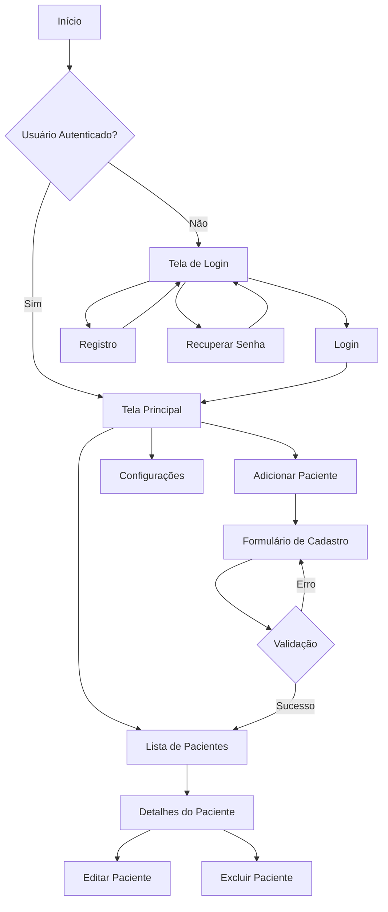

# OnData - Sistema de Cadastro de Pacientes

## Sumário

- [Equipe](#equipe)
- [Descrição Geral](#descrição-geral-do-projeto)
- [Pré-requisitos](#pré-requisitos)
- [Instalação](#instalação)
- [Configuração](#configuração)
- [Uso](#uso)
- [Estrutura do Projeto](#estrutura-do-projeto)
- [Funcionalidades](#funcionalidades)
- [Tecnologias](#tecnologias-utilizadas)
- [Documentação Detalhada](#documentação-detalhada)
- [Atualizações Recentes](#atualizações-recentes)

## Equipe
> Artur Lopes Fiorindo » 53481

> Eduardo Felipe Nunes Função » 553362 

> Jhoe Yoshio Kochi Hashimoto » 553831

## Descrição Geral do Projeto

O OnData é uma aplicação móvel desenvolvida em React Native dedicada ao gerenciamento e cadastro de pacientes. 

### Objetivo
Facilitar o processo de gerenciamento de informações de pacientes em ambientes clínicos e hospitalares, oferecendo uma interface intuitiva e funcional para profissionais da saúde.

### Público-alvo
- Profissionais da área da saúde
- Administradores de clínicas e hospitais
- Recepcionistas e assistentes administrativos

### Funcionalidades Principais
1. **Gestão de Pacientes**
   - Cadastro completo de novos pacientes
   - Edição de informações cadastrais
   - Exclusão de registros
   - Visualização detalhada dos dados

2. **Sistema de Autenticação**
   - Login seguro com email e senha
   - Recuperação de senha
   - Registro de novos usuários
   - Autenticação via JWT

3. **Gerenciamento de Dados**
   - Validação automática de campos
   - Formatação automática de CPF e datas
   - Persistência de dados local
   - Sincronização com backend

## Pré-requisitos

### Sistema Operacional
- iOS 11.0 ou superior
- Android 6.0 (API 23) ou superior
- Windows/macOS/Linux (para desenvolvimento)

### Ferramentas Necessárias
1. **Ambiente de Desenvolvimento**
   - [Node.js](https://nodejs.org/) (versão 14.0 ou superior)
   - npm ou yarn
   - Git

2. **Ferramentas de Desenvolvimento**
   - [Expo CLI](https://docs.expo.dev/get-started/installation/)
   - [JSON Server](https://github.com/typicode/json-server)
   - Editor de código ([VSCode](https://code.visualstudio.com/) recomendado)

3. **Para Dispositivos Móveis**
   - Expo Go App instalado
   - Emulador Android/iOS (opcional)

## Instalação

### 1. Clone este repositório:
```bash
git clone https://github.com/ArtFiorindo/Challenge_mobile.git
cd Challenge_mobile
```

### 2. Instalação de Dependências
```bash
yarn install
# ou
npm install
```

## Configuração

### Backend (Desenvolvimento)
```bash
npm install -g json-server
json-server --watch db.json --port 3000
# ou
node server.js
```

A API estará disponível em `http://localhost:3000`.

### Frontend
1. Inicie o aplicativo:
```bash
yarn start
```

2. Opções de execução:
- Escaneie o QR Code com o Expo Go (Android/iOS)
- Pressione 'w' para abrir no navegador
- Pressione 'a' para abrir no emulador Android
- Pressione 'i' para abrir no emulador iOS

## Estrutura do Projeto

```plaintext
OnData/
├── assets/                         # Recursos estáticos
├── src/
│   ├── components/                 # Componentes reutilizáveis
│   │   ├── AdicionarPaciente.tsx   # Formulário de cadastro
│   │   ├── ListaPacientes.tsx      # Lista de pacientes
│   │   ├── Footer.tsx              # Navegação inferior
│   │   ├── Header.tsx              # Cabeçalho
│   │   ├── Layout.tsx              # Layout base
│   │   └── PacienteItem.tsx        # Item de paciente
│   ├── hooks/                      # Hooks personalizados
│   │   └── EstadoGlobal.tsx        # Estado global
│   ├── navigation/                 # Configuração de rotas
│   │   ├── AppNavigator.tsx
│   │   └── types.ts
│   ├── screens/                    # Telas da aplicação
│   │   ├── CadastroPacienteScreen.tsx
│   │   ├── ConfiguracaoScreen.tsx
│   │   ├── DetalhesPacienteScreen.tsx
│   │   ├── LoginScreen.tsx
│   │   ├── HomeScreen.tsx
│   │   ├── RegisterScreen.tsx
│   │   ├── PerfilUsuarioScreen.tsx
│   │   └── ResetPasswordScreen.tsx
├── App.tsx                         # Ponto de entrada
└── README.md                       # Documentação
```

## Fluxo do Aplicativo



## Tecnologias Utilizadas

### React Native
O projeto utiliza React Native como framework principal, aproveitando seus benefícios:
- Desenvolvimento cross-platform
- Alta performance
- Componentes reutilizáveis
- Hot Reloading para desenvolvimento

### Principais Bibliotecas
1. **UI/UX**
   - [NativeBase](https://nativebase.io/) (componentes)
   - [React Native Vector Icons](https://github.com/oblador/react-native-vector-icons) (ícones)
   - [React Navigation](https://reactnavigation.org/) (navegação)

2. **Dados e Estado**
   - [AsyncStorage](https://github.com/react-native-async-storage/async-storage) (persistência local)
   - Context API (gerenciamento de estado)

3. **Segurança**
   - [JWT](https://github.com/auth0/node-jsonwebtoken) (autenticação)
   - [Bcrypt](https://github.com/kelektiv/node.bcrypt.js) (criptografia)

## Funcionalidades Detalhadas

### Autenticação de Usuários
- Login com email e senha
- Recuperação de senha via email
- Registro de novos usuários
- Persistência de sessão
- Logout seguro

### Gestão de Pacientes
1. **Cadastro**
   - Informações pessoais
   - Dados de contato
   - Histórico médico
   - Documentos

2. **Edição**
   - Atualização de dados
   - Histórico de alterações
   - Validação de campos

3. **Visualização**
   - Lista de pacientes
   - Detalhes individuais
   - Filtros e busca
   - Ordenação

### Validações de Formulário
- **Validação de Email**: Verificação de formato válido
- **Validação de Senha**: Requisitos mínimos de segurança
- **Campos obrigatórios**: Indicação visual e mensagens de erro
- **Formatação automática**:
  - CPF: XXX.XXX.XXX-XX
  - Data: DD/MM/YYYY
  - Telefone: (XX) XXXXX-XXXX

## Atualizações Recentes

### Sistema de Autenticação (Março 2025)
- **Login baseado em Email**: Migração para autenticação via email
- **Token JWT**: Implementação de tokens para segurança
- **AsyncStorage**: Persistência local de sessão
- **Criptografia**: Implementação de bcrypt
- **Login Social**: Preparação para Google e Apple Sign-In

### Modernização da Interface (Maio 2025)
- **Design System**: Implementação de sistema de design consistente
- **Componentes**: Biblioteca de componentes reutilizáveis
- **Acessibilidade**: Melhorias para usuários com necessidades especiais
- **Responsividade**: Adaptação para diferentes tamanhos de tela
- **Temas**: Suporte a modo claro e escuro

### Melhorias de Performance (Maio 2025)
- **Lazy Loading**: Carregamento otimizado de componentes
- **Cache**: Implementação de sistema de cache
- **Otimização de Imagens**: Compressão e carregamento progressivo
- **Estado**: Gerenciamento eficiente com Context API

## Documentação da API

### Endpoints Principais
```typescript
// Autenticação
POST   /api/auth/login
POST   /api/auth/register
POST   /api/auth/reset-password

// Pacientes
GET    /api/patients
POST   /api/patients
GET    /api/patients/:id
PUT    /api/patients/:id
DELETE /api/patients/:id
```

## Próximos Passos

### Versão 2.0 (Planejada para Julho 2025)
1. **Funcionalidades**
   - Agendamento de consultas
   - Histórico médico completo
   - Integração com prontuário eletrônico
   - Notificações push

2. **Melhorias Técnicas**
   - Migração para React Native CLI
   - Implementação de testes automatizados
   - CI/CD pipeline
   - Monitoramento de erros

3. **Interface**
   - Redesign completo da UI
   - Novos componentes animados
   - Melhorias de UX baseadas em feedback

## Suporte

### Contato
- **Email**: suporte@ondata.com
- **GitHub**: [@ArtFiorindo](https://github.com/ArtFiorindo)
- **Issues**: [GitHub Issues](https://github.com/ArtFiorindo/Challenge_mobile/issues)

### Contribuição
1. Faça um Fork do projeto
2. Crie uma branch para sua feature (`git checkout -b feature/AmazingFeature`)
3. Commit suas mudanças (`git commit -m 'Add some AmazingFeature'`)
4. Push para a branch (`git push origin feature/AmazingFeature`)
5. Abra um Pull Request

---

## Licença
Este projeto está sob a licença MIT. Veja o arquivo [LICENSE](LICENSE) para mais detalhes.

---
